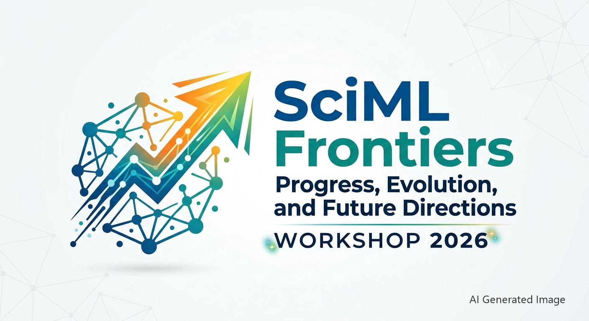

  <figure class="logo-box">
    
    <figcaption class="logo-caption">
      <strong>22–23 September 2026 • Augsburg, Germany</strong>
    </figcaption>
  </figure>

Scientific Machine Learning (SciML), the fusion of scientific computing and machine learning algorithms, 
has proven to be a transformative force in academia and is rapidly establishing a firm foothold in industrial applications. 
A [foundational 2018 workshop](https://doi.org/10.2172/1478744) outlined six priority research directions (PRDs) for the nascent field of SciML, 
anchoring future development around critical pillars such as domain awareness, robustness, and interpretability.
The SciML landscape has evolved profoundly over the past seven years. Considering these advancements, this workshop, hosted by 
the Center of Advanced Analytics and Predictive Sciences at the University of Augsburg, convenes researchers from diverse disciplines 
to re-evaluate the original priorities within the context of current technological frontiers. Through expert keynotes, technical presentations, 
and collaborative breakout sessions, participants will share practical insights and critically analyze current progress and emerging challenges within the field. 
Our primary objective is to assess the trajectory of the original PRDs and collaboratively shape the future research agenda for SciML.
The insights generated during this two-day event will be synthesized into a comprehensive scientific article, targeting high-impact journals such as Nature Machine Intelligence or Neurocomputing.

We have synthesized the original six PRDs into four focused research directions, which participants will explore deeply during the breakout sessions.

  <figure class="pkg-card">
    
    
    <figcaption>
      
Numerical Foundation of SciML

      
t.b.d.

    </figcaption>
  </figure>

  <figure class="pkg-card">
    
    
    <figcaption>
      
Beyond prediction

      
Control, Optimization and Application

    </figcaption>
  </figure>

  <figure class="pkg-card">
    
    
    <figcaption>
      
Automation and Scalability in SciML

      
t.b.d.

    </figcaption>
  </figure>

  <figure class="pkg-card">
    
    
    <figcaption>
      
Domain Awareness and Interpretability

      
t.b.d.

    </figcaption>
  </figure>

The event is organised  by [Prof. Lars Mikelsons](https://www.uni-augsburg.de/en/fakultaet/fai/informatik/prof/imech/) and [Prof. Michael Schlottke-Lakemper](https://www.uni-augsburg.de/en/fakultaet/mntf/math/prof/hpsc/)
 and hosted by the [Centre for Advanced Analytics and Predictive Sciences](https://www.uni-augsburg.de/en/forschung/einrichtungen/institute/caaps/) at the University of Augsburg.

  

