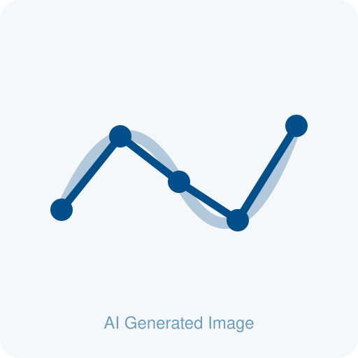
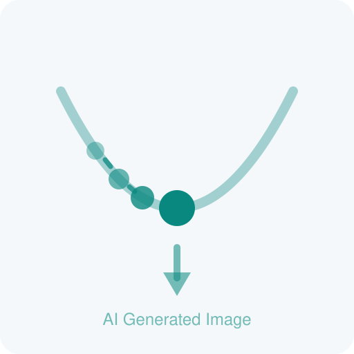
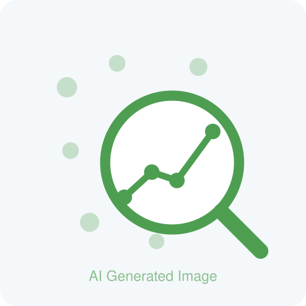

  <figure class="logo-box">
    
    <figcaption class="logo-caption">
      <strong>22–23 September 2026 • Augsburg, Germany</strong>
    </figcaption>
  </figure>

Scientific Machine Learning (SciML), the fusion of scientific computing and machine learning algorithms, 
has proven to be a transformative force in academia and is rapidly establishing a firm foothold in industrial applications. 
The [foundational 2018 SciML workshop](https://www.osti.gov/biblio/1478744) outlined six priority research directions (PRDs) for the nascent field of SciML, 
anchoring future development around critical pillars such as domain awareness, robustness, and interpretability.
The SciML landscape has evolved profoundly over the past seven years. Considering these advancements, this workshop, hosted by 
the Centre for Advanced Analytics and Predictive Sciences at the University of Augsburg, convenes researchers from diverse disciplines
to re-evaluate the original priorities within the context of current technological frontiers. Through expert keynotes, technical presentations, 
and collaborative breakout sessions, participants will share practical insights and critically analyse current progress and emerging challenges within the field. 
Our primary objective is to assess the trajectory of the original PRDs and collaboratively shape the future research agenda for SciML.
The insights generated during this two-day event will be synthesised into a comprehensive scientific article, targeting high-impact journals such as Nature Machine Intelligence or Neurocomputing.

We have synthesised the original six PRDs into four focused research directions, which participants will explore deeply during the breakout sessions.

  <figure class="pkg-card">
    
    <figcaption>
      
Numerical Foundation of SciML

      
Discretisation, Stability and Convergence

    </figcaption>
  </figure>

  <figure class="pkg-card">
    
    <figcaption>
      
Beyond prediction

      
Control, Optimisation and Application

    </figcaption>
  </figure>

  <figure class="pkg-card">
    
    <figcaption>
      
Automation and Scalability in SciML

      
From Prototype to Production Scale

    </figcaption>
  </figure>

  <figure class="pkg-card">
    
    <figcaption>
      
Domain Awareness and Interpretability

      
Physical Priors, Explainability and Trust

    </figcaption>
  </figure>

The event is organised by Prof. Lars Mikelsons, Prof. Michael Schlottke-Lakemper and Andreas Hofmann
(see [Organisers](organizers.qmd)), and is hosted by the [Centre for Advanced Analytics and Predictive Sciences](https://www.uni-augsburg.de/en/forschung/einrichtungen/institute/caaps/) at the University of Augsburg.

  

