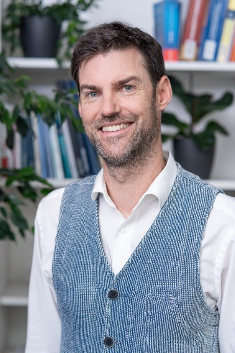

  <figure class="pkg-card">
    
    
    <figcaption>
      
Prof. Lars Mikelsons

      
Chair of Mechatronics University of Augsburg

    </figcaption>
  </figure>

  <figure class="pkg-card">
    
    
    <figcaption>
      
Prof. Michael Schlottke-Lakemper

      
High-Performance Scientific Computing University of Augsburg

    </figcaption>
  </figure>

  <figure class="pkg-card">
    
    
    <figcaption>
      
Andreas Hofmann

      
Chair of Mechatronics University of Augsburg

      
<strong>Feel free to contact me with any questions about the workshop.</strong>

    </figcaption>
  </figure>

