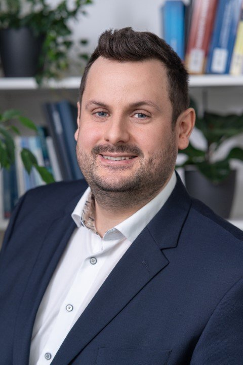

The insights generated during this two-day event will be synthesised into a comprehensive scientific article, targeting high-impact journals such as Nature Machine Intelligence or Neurocomputing.

The article will be written collaboratively after the workshop and will build on the results of the
four breakout sessions. All participants are invited to contribute as authors.

If you would like to take part in writing the article, get access to the overleaf project, or if you have any questions about the publication, please get in touch:

  <figure class="pkg-card">
    
    
    <figcaption>
      
Andreas Hofmann

      
Chair of Mechatronics University of Augsburg

      
Feel free to contact me with any questions about the publication.

    </figcaption>
  </figure>

