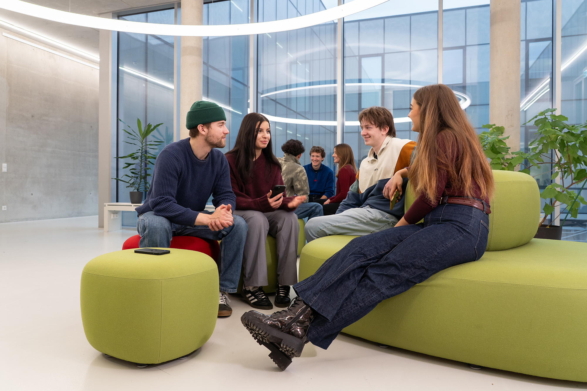

  <figure class="media-box">
    
    <figcaption class="media-caption">
      <strong>Building W, University of Augsburg</strong>
    </figcaption>
  </figure>

The SciML Frontiers 2026 workshop will take place at building W of the University of Augsburg, Germany.

All scheduled talks and plenary sessions will be held in lecture hall T.B.D. (room T.B.D.). Four adjacent seminar rooms (T.B.D. – T.B.D.) will host the breakout sessions. The foyer of Building W will serve as the catering area for lunch and coffee breaks.

## Address
University of Augsburg\
Division of Applied Informatics\
Building W\
Am Technologiezentrum 8\
86159 Augsburg\
Germany

  <figure class="media-box">
    <iframe
      width="425"
      height="350"
      src="https://www.openstreetmap.org/export/embed.html?bbox=10.8934484%2C48.3266360%2C10.8964984%2C48.3281620&amp;layer=mapnik&amp;marker=48.3273990%2C10.8949734">
    </iframe>
    <figcaption class="media-caption">
      <a href="https://www.openstreetmap.org/directions?from=&to=48.327399%2C10.894973" target="_blank">Directions (OpenStreetMap)</a> |
      <a href="https://www.google.com/maps/dir/?api=1&amp;destination=48.327399%2C10.894973" target="_blank">Directions (Google Maps)</a>
    </figcaption>
  </figure>

## Evening activity
On Tuesday evening we will have a social event at T.B.D.